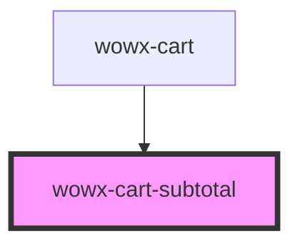

# wx-cart-subtotal

<!-- Auto Generated Below -->

## Properties

| Property    | Attribute    | Description | Type     | Default     |
| ----------- | ------------ | ----------- | -------- | ----------- |
| `maxQty`    | `max-qty`    |             | `number` | `undefined` |
| `price`     | `price`      |             | `number` | `undefined` |
| `productId` | `product-id` |             | `string` | `undefined` |

## Events

| Event             | Description | Type               |
| ----------------- | ----------- | ------------------ |
| `subtotalUpdated` |             | `CustomEvent<any>` |

## Dependencies

### Used by

 - [wowx-cart](..)

### Graph

----------------------------------------------

*Built with [StencilJS](https://stenciljs.com/)*
